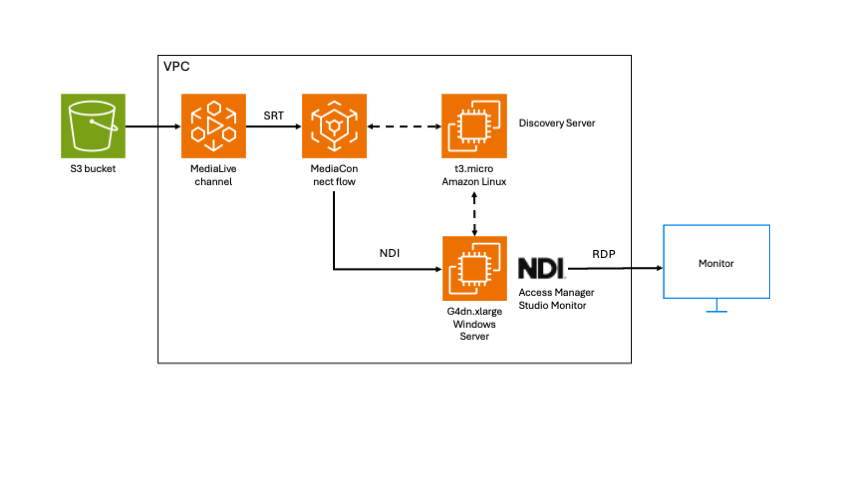

# awscdk-app-mediaconnect-ndi-demo

AWS CDK app for setting up MediaConnect NDI output demo

## Summary
* The demo shows a file in an S3 bucket being converted into an NDI stream
* A new VPC is created; all the resouces are located in the VPC
* MediaLive is used to convert the S3 file into an SRT stream
* The SRT stream is converted into an [NDI output](https://docs.aws.amazon.com/mediaconnect/latest/ug/outputs-using-ndi.html) by MediaConnect
* 2x EC2 instances are deployed; one is for NDI Discovery, the other is for the preview of NDI stream
* [NDI Tools](https://ndi.video/tools/) are installed for the preview via RDP



## Install
1. Setup [CDK](https://docs.aws.amazon.com/cdk/v2/guide/getting_started.html) environment (including Node.js)

2. Install this CDK app
```
$ git clone https://github.com/kuu/awscdk-app-mediaconnect-ndi-demo.git
$ cd awscdk-app-mediaconnect-ndi-demo
$ npm install
```
3. Modify `./lib/awscdk-app-mediaconnect-ndi-demo-stack.ts` if necessary, e.g. for changing the source file, adding outputs to the flow, etc.

## Deploy
```
$ npx cdk deploy
```
* Even if the deployment looked finished, you may not be able to login the Windows instance until the NVIDIA driver is installed and the system rebooted.
* Once you can log in the windows instance via RDP, please download/install the NDI Tools from https://ndi.video/tools/
* When the deployment finished, MediaLive and MediaConnect should already be up and running. Please obtain the NDI Discovery Server's IP address from the MediaConnect console and configure the NDI Tools' Access Manager with the IP address so you should be able to recieve the NDI stream using NDI Tools' Studio Monitor.

### Resources
The following resources will be deployed:
* AWS::EC2::VPC x 1
* AWS::MediaLive::Input x 1
* AWS::MediaLive::Channel x 1
* AWS::MediaConnect::Flow x 1
* AWS::MediaConnect::FlowOutput x 1
* AWS::EC2::Instance x 2
* AWS::SecretsManager::Secret x 1 (for SRT source)
* AWS::EC2::VPCEndpoint x 3 (to allow Systems Manager access private subnet)

### Outputs
After the deployment, the following information will be printed:
* MediaConnect flow ARN
* Admin credential for RDP login
* Command to start port forwarding for RDP connection
* The instruction on how to connect via RDP client
* Path to the installation log file

## Cleanup
```
$ npx cdk destroy
```
* If an error occurred, please manually delete the VPC endpoint and the VPC itself.
